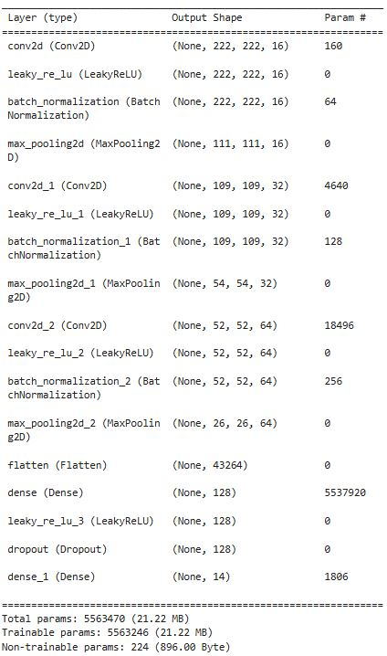
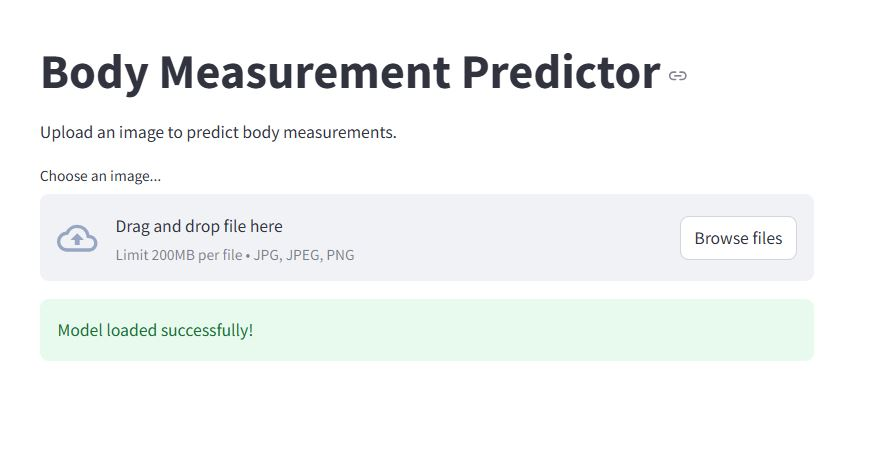

# BODY PARTS MEASUREMENT PREDICTION

This is a **Human Body Parts Measurement Prection WebApp** which takes in a image of a person and gives the body parts predicted. It predicts body parts of the person in the image, in centimeters such as ankle, calf, height,waist and so on 14 body parts.

## MODEL

Model has been created from scratch using the **Registry of Open Data on AWS**. Below are the model details

## DATASET

The dataset is publicly available on AWS website . The first large public body measurement dataset including 8978 frontal and lateral silhouettes for 2505 real subjects, paired with height, weight and 14 body measurements. The following artifacts are made available for each subject.

* Subject Height
* Subject Weight
* Subject Gender
* Two black-and-white silhouette images of subject standing in frontal and side pose respectively with full body in view.
* 14 body measurements in cm - {ankle girth, arm-length, bicep girth, calf girth, chest girth, forearm girth, height, hip girth, leg-length, shoulder-breadth, shoulder-to-crotch length, thigh girth, waist girth, wrist girth}

**Dataset can be accessed [HERE](https://registry.opendata.aws/bodym/)**

This repository uses Github Actions to directly push the files to Huggingface Space. Before using it you must configure your repo using Huggingface Workflow yaml. Model used is Yolov8x.

### Get all the files along with the model **[HERE](https://huggingface.co/spaces/datasciencesage/body-parts-measurements-prediction/tree/main)**

### The Webapp is Deployed using Huggingface Spaces.

**[DEPLOYED-HERE](https://datasciencesage-body-parts-measurements-prediction.hf.space)**

### Landing Page

